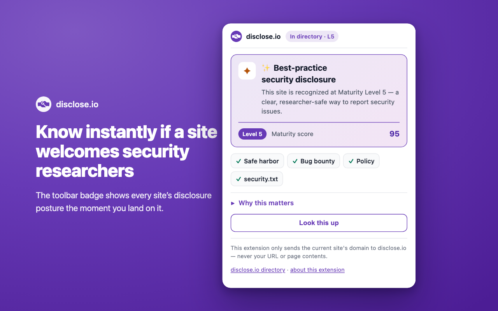
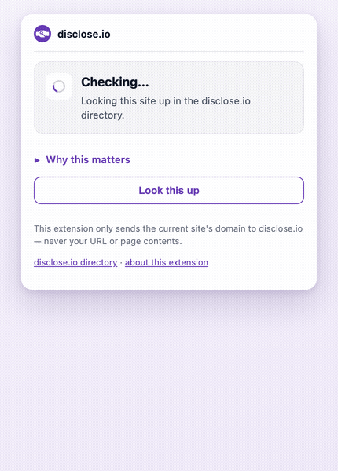
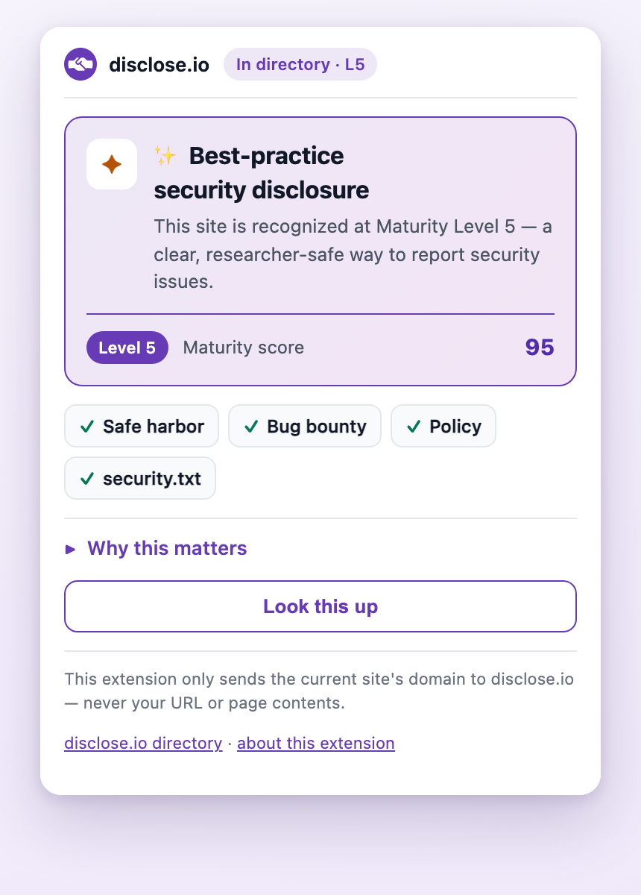
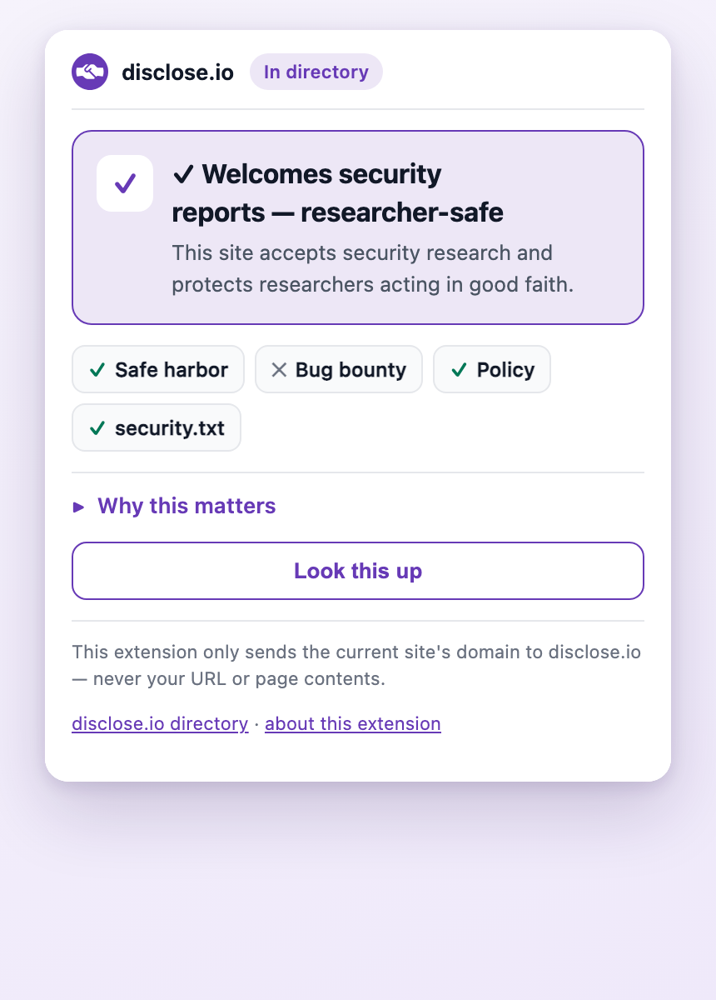
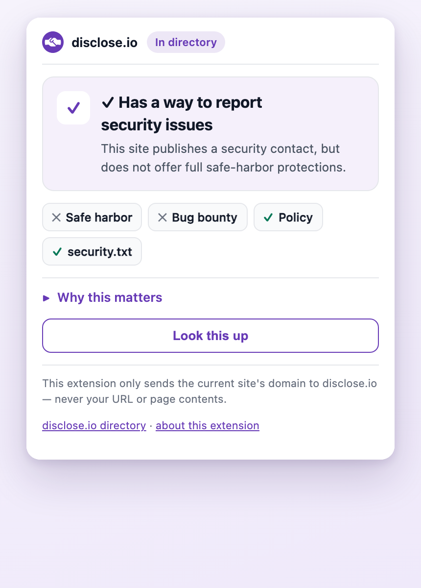
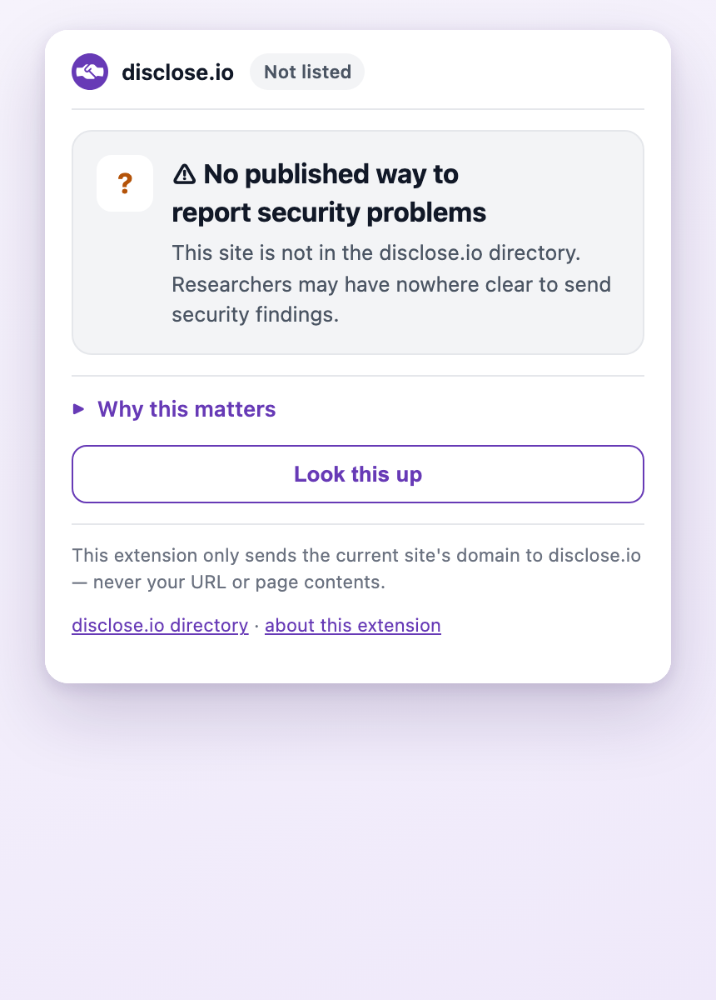
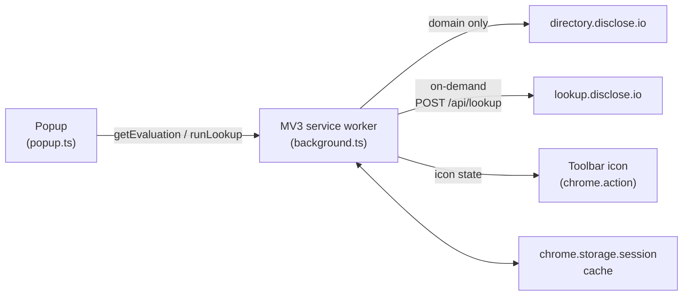

<div align="center">



# disclose.io: the browser extension

### Does this website take security seriously? Know at a glance.

<p>
<a href="https://github.com/disclose/chrome-extension-v2/actions/workflows/ci.yml"></a>
<a href="https://github.com/disclose/chrome-extension-v2/actions/workflows/codeql.yml"></a>
<a href="https://scorecard.dev/viewer/?uri=github.com/disclose/chrome-extension-v2"></a>
<a href="https://github.com/disclose/chrome-extension-v2/releases/latest"></a>
<a href="LICENSE"></a>


</p>
<!-- After Chrome Web Store publish, add: img.shields.io/chrome-web-store/{v,users,rating}/<EXTENSION_ID> badges + the official "Available in the Chrome Web Store" button, linked to the listing. -->

A free, open-source Chrome extension that shows you, for any site you visit, whether it has a safe, published way to report security problems. One quiet signal of how much you can trust it.



*Part of [the disclose.io Project](https://disclose.io) · [directory.disclose.io](https://directory.disclose.io) · [lookup.disclose.io](https://lookup.disclose.io)*

</div>

---

## What it does

The moment you land on a website, the disclose.io icon in your toolbar tells you whether that site **welcomes security researchers**, meaning it has published a clear way to report security problems, and (ideally) promises not to punish the people who do.

Open the popup and you get the details in plain language: does it have **safe harbor**? A **bug bounty**? A published **policy** and **security.txt**? And an overall **disclosure-maturity** score, straight from the disclose.io directory. One click runs a deeper live lookup for a security contact.

No account. No tracking. It only ever sends the site's **domain**, never your URL, your page, or anything about you.

## Why this matters, even if you never report a bug

Most people will never file a vulnerability report. So why should you care whether a website "welcomes security researchers"?

Because it's one of the clearest, most honest signals you can get about whether a company **actually has its act together on security**. And, by extension, how much you can trust it with your data, your money, and your time.

Think about what it takes for a company to publish a real vulnerability disclosure program:

- **Someone owns security** and is reachable, not a black hole.
- There's a **process** to receive a problem, triage it, and actually *fix* it.
- Legal has signed off on **safe harbor**: a public promise not to sue the good-faith hacker who reports a flaw instead of exploiting it.
- And it's **maintained**, not posted once and forgotten.

A company only gets there if the machinery behind it is mature. That's the insight: **disclosure maturity is a visible proxy for security maturity, and security maturity is a proxy for trustworthiness.** It's the security equivalent of a restaurant with an open kitchen. The willingness to be looked at is itself the signal.

The opposite is a signal too. A site with **no way to report a problem**, or one that threatens the people who try to warn it, is telling you something about how it will treat *your* security when it matters.

This extension takes a judgment that used to require an expert and turns it into a glance, on every site you visit.

## What the badge tells you

<table>
<tr>
<td width="25%"></td>
<td width="25%"></td>
<td width="25%"></td>
<td width="25%"></td>
</tr>
<tr>
<td valign="top"><b>✨ Best practice (Level&nbsp;5)</b><br>A clear, mature, researcher-safe disclosure program. The gold standard.</td>
<td valign="top"><b>✓ Welcomes researchers</b><br>Full <b>safe harbor</b>: it accepts security research and protects good-faith reporters.</td>
<td valign="top"><b>✓ Has a channel</b><br>There's a way to report a security issue, but without full safe-harbor protection.</td>
<td valign="top"><b>⚠ Not listed</b><br>No published way to report security problems. Researchers may have nowhere to turn.</td>
</tr>
</table>

The color of the toolbar icon encodes the same thing at a glance: deeper purple means higher maturity, so you get the signal without even opening the popup.

## Install

**Chrome Web Store:** *coming soon*. The listing is in review. ⭐ this repo to hear when it's live.

**Install from a release (no build needed):**

1. Download **`disclose-extension.zip`** from the [latest release](https://github.com/disclose/chrome-extension-v2/releases/latest) and unzip it.
2. Open `chrome://extensions` → turn on **Developer mode** (top-right).
3. Click **Load unpacked** and select the unzipped folder.
4. Click the puzzle-piece 🧩 in the toolbar and **pin** disclose.io so the badge stays visible.

> Release builds are unsigned and won't auto-update until the Web Store listing is live. Watch [Releases](https://github.com/disclose/chrome-extension-v2/releases) for new versions.

**Build it yourself (developer mode):**

1. Clone the repo and build it:
   ```sh
   bun install
   bun run build      # produces dist/
   ```
2. Open `chrome://extensions` → turn on **Developer mode** (top-right).
3. Click **Load unpacked** and select the **`dist/`** folder.
4. Click the puzzle-piece 🧩 in the toolbar and **pin** disclose.io so the badge stays visible.

After any change: `bun run build`, then hit **reload ↻** on the extension's card.

## Your privacy comes first

- It only ever sends the current site's **domain** (e.g. `example.com`), never your URL, query string, or page contents.
- Requests are **anonymous**: no cookies, no account, no identifier.
- The directory check runs automatically; the deeper `lookup.disclose.io` query only runs when **you** click "Look this up."
- Results are cached locally in `chrome.storage.session` and cleared when the browser restarts. No browsing-history storage.
- `host_permissions` are limited to `directory.disclose.io` and `lookup.disclose.io`: the extension can't touch any other site.

Full policy: **[disclose-extension-privacy.pages.dev](https://disclose-extension-privacy.pages.dev/)**.

## How it works

- On each top-frame navigation, the MV3 service worker takes the active tab's eTLD+1 and queries `directory.disclose.io/?q=<name>` for matching programs.
- Matches are filtered with the same hosting-domain + entity-match logic the `lookup.disclose.io` server uses, so a platform-hosted policy doesn't make every program match.
- The maturity/verdict and icon color are derived from the matched program (`src/lib/maturity.ts`).
- When you run a live lookup, the popup calls `POST https://lookup.disclose.io/api/lookup` for a richer answer (security.txt, security-page probe, retaliation-history overlay).

No new infrastructure: it consumes the existing disclose.io directory and lookup services.



## Development

```sh
bun install
bunx playwright install chromium   # one-time: Chromium the test runner loads the extension into
bun run build        # esbuild bundle + sharp icon rendering → dist/
bun run test         # mocked Playwright suite + axe-core a11y scan
SMOKE=1 bun run test # also hits production directory.disclose.io as a sanity check
bun run package      # → disclose-extension.zip for Web Store upload
```

<details>
<summary><b>Project layout</b></summary>

```
src/
  background.ts   # MV3 service worker: tab listeners, debounce, dedupe
  popup/          # popup HTML, TypeScript, brand CSS (#673AB6 design tokens)
  lib/
    directory.ts  # live directory.disclose.io poll (HTML → ProgramSnapshot)
    match.ts      # eTLD+1, hosting-domain filter, entity matching
    maturity.ts   # icon-state derivation + verdict copy
    lookup.ts     # POST lookup.disclose.io/api/lookup
    icon.ts       # chrome.action setIcon/setTitle
    cache.ts      # chrome.storage.session + in-flight dedupe
scripts/build.ts  # esbuild + brand icon rendering (ICON_THEMES)
store/            # Chrome Web Store package: privacy policy, listing, assets
docs/marketing/   # README screenshots + walkthrough frames
```

</details>

The popup and icons follow the **disclose.io design system** (brand `#673AB6`, the real disclose.io mark). Design tokens live in `src/popup/popup.css` `:root` and `scripts/build.ts` `ICON_THEMES`.

## Part of disclose.io

disclose.io is a vendor-agnostic, nonprofit project driving the adoption of vulnerability-disclosure best practice: **bilateral safe harbor**, plain-language terms, and a recognizable mark of good faith between hackers and the organizations they help.

[disclose.io](https://disclose.io) · [The Terms (dioterms)](https://github.com/disclose/dioterms) · [The List (directory)](https://directory.disclose.io) · [The Seal (dioseal)](https://github.com/disclose/dioseal) · [lookup.disclose.io](https://lookup.disclose.io)

## License

[MIT](LICENSE) © The disclose.io Project. Free to use, modify, and distribute, in the spirit of the open, vendor-agnostic disclose.io mission.
